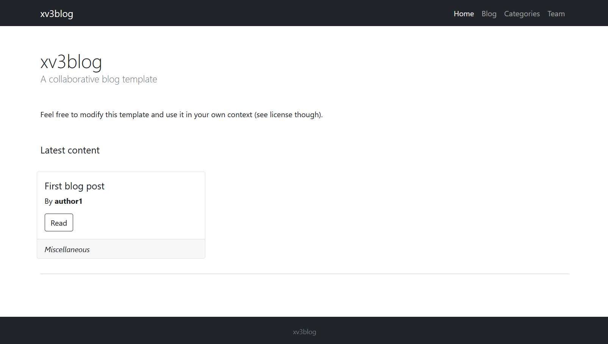
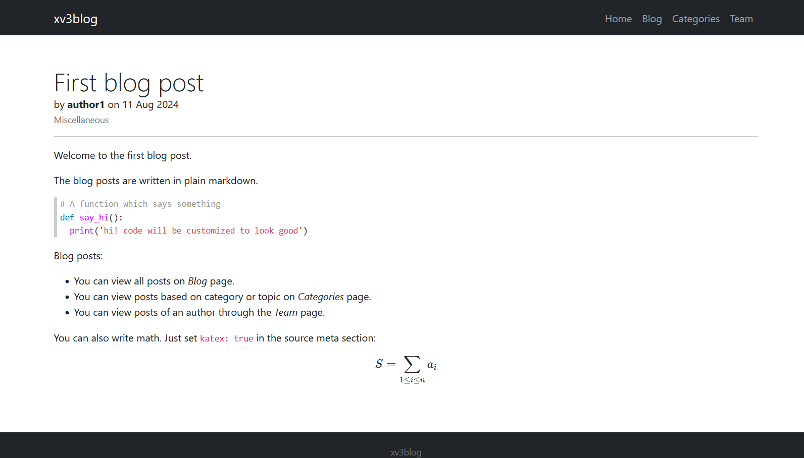

# xv3blog
A collaborative blog template using Jekyll and bootstrap

## Features

- Blog posts in form of markdown files, favouring plain text editors and programmers.
- Has styling for math and code.
- Grouping of posts by authors and categories.

## Preview

Home page

Blog post

